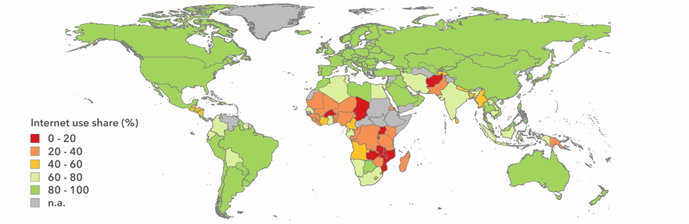

# 2. State of the Art
<!-- \label{ch:state-of-the-art} -->

This chapter surveys the hardware deployment, and documentation landscape this thesis builds on. It covers reference community-network projects, open-source router firmware (OpenWrt), mass-deployment tools for endpoint devices, Linux distributions for low-end hardware, and approaches to documenting engineering work in volunteer organisations.

The companion thesis [Motje, 2026] covers the software-services state of the art (virtualisation, identity, file services, monitoring, VPN). To avoid duplication, this chapter only touches those topics where they cross the hardware/software boundary. Both theses share the same bibliography backbone.

---

## 2.1 The digital divide and community networks

The ITU's annual *Measuring digital development* reports document that roughly a third of the world's population remains offline, with the gap concentrated in rural and low-income areas of low- and middle-income countries [ITU]. The classical analysis distinguishes a *first-level* divide (infrastructure access), a *second-level* divide (skills and use), and a *third-level* divide (unequal benefits derived from being online) [van Dijk, 2020].




Two structural responses have emerged where commercial ISPs do not find it profitable to serve sparsely-populated or low-income areas. The first is *public* infrastructure: state- or municipality-led broadband programmes with mixed track records. The second, more relevant to this work, is the **community network**: infrastructure built, operated, and governed by the community it serves. Belli's edited volume *Community Networks: the Internet by the People, for the People* [Belli, 2017] surveys the model across continents, and APC's *Local Access Networks* report [APC] documents the regulatory and economic conditions under which it succeeds.

The Community Network Handbook produced partially by this thesis operates within this community-network tradition and, read against the ITU framework, attacks the first two levels of the divide directly. The first level — infrastructure access — is addressed by the field-tested documentation, enabling volunteers and communities to deploy and operate their own network. The second level — skills and use — is addressed by the endpoint pipeline and the seminars for staff, user guides written for non-specialists, and deliberate technical choices that lower the entry cost. The third-level divide — unequal benefits derived from being online — is acknowledged but is out of scope for a hardware thesis.


Reference deployments cited throughout the literature include:

- **Guifi.net** (Catalonia) — the largest community network worldwide, with tens of thousands of nodes and a well-developed legal-economic *compact*.
- **AlterMundi** (Argentina) — mesh-based rural networks with locally-manufactured routers.
- **Rhizomatica** (Mexico) — community GSM in indigenous regions.
- **Zenzeleni** (South Africa) — a cooperative WISP serving the Eastern Cape.

These networks share a methodological commitment also adopted here: the *operational knowledge* required to run the network is treated as a public good, not as proprietary expertise.

What the literature does *not* converge on is a reproducible playbook that a small student association can pick up and execute on a single site — without first becoming experts in regulatory negotiation, fundraising, or hardware design. The AUCOOP Community Network Handbook was developed to fill that practitioner-level gap.


## 2.2 The open networking stack on commodity hardware

The site-layer technical baseline of this work is **OpenWrt**, the Linux distribution for embedded networking devices. OpenWrt decouples the firmware from the manufacturer and exposes a full Linux userspace on consumer-grade routers. This makes the same recipe (§3.A.5) portable across hardware generations and vendors.

Three wireless mesh protocols dominate the practitioner literature:

- **IEEE 802.11s** — the standardised mesh extension of 802.11, with HWMP path selection. Standardisation is the reason it was chosen for the deployments of §4: drivers are available across vendors, and the recipe of §3.A.5 does not depend on any single hardware family.
- **B.A.T.M.A.N. advanced (`batman-adv`)** [open-mesh.org] — a layer-2 mesh protocol popular in the Freifunk and Guifi.net communities. It has stronger convergence properties on large topologies, but a steeper learning curve and a smaller default driver footprint on consumer routers.
- **OLSR/OLSRv2** — a layer-3 link-state mesh protocol of historical importance in early community-network deployments.

This thesis adopts 802.11s for the reasons of standardisation and recipe portability stated above.


For inter-building point-to-point links, the practitioner standard is the **Ubiquiti airMAX** family (NanoBeam, LiteBeam, PowerBeam), with **MikroTik** and **TP-Link CPE** lines as alternatives. The choice is driven by terrain profile and budget; §3.A.6 documents the methodology without committing to a single vendor.

The reference hardware used in this work is:

- **Cudy WR3000E** — a consumer Wi-Fi 6 router with full OpenWrt support and a 12 V power input that integrates cleanly with a small UPS.
- **NanoPi R-series** single-board computers — used as gateways with capacity for boundary services (DHCP, DNS, basic monitoring) and as hosts for the software stack documented in [Motje, 2026].


## 2.3 Mass operating-system deployment

The endpoint work-stream of §3.B builds on a network-boot foundation that has been stable for two decades. The relevant components are:

- **PXE** (Preboot eXecution Environment) [Intel, 1999] — the firmware protocol by which a UEFI or BIOS client requests a boot file via DHCP and TFTP. PXE is implemented by every business-class machine manufactured in the last fifteen years.
- **GRUB** — used to generate an EFI network-boot binary that loads a kernel and initrd from TFTP.
- **iPXE** — an open-source replacement for the firmware PXE stack with HTTP, iSCSI, and scripting support. Not used here, as the built-in UEFI PXE is sufficient for the fleet sizes involved.

For the imaging step itself, the main practitioner options are:

- **Clonezilla** [Clonezilla] — supports per-partition, filesystem-aware imaging (only used blocks are copied), local-device or network image repositories, and a Live CD/USB workflow that is easily scripted. This is the tool used in §3.B.
- **DRBL** (Diskless Remote Boot in Linux) [DRBL] — the same authors' larger framework that bundles PXE, NFS, and Clonezilla into a single managed system. DRBL is the right answer for fleets in the hundreds; it adds operational complexity that does not pay off for a deployment below 50 machines.
- **FOG Project** — a popular open-source imaging server with a web UI; comparable in capability to DRBL.
- **Microsoft Deployment Toolkit (MDT)** and **Windows Deployment Services (WDS)** — the equivalent in the Windows ecosystem; not applicable to this work.


## 2.4 Linux distributions for low-end hardware

The endpoint OS choice of §3.B.3 selects from a well-documented field:

| Distribution | Strengths | Weaknesses for this context |
|---|---|---|
| Ubuntu | Largest software ecosystem; LTS cadence | GNOME desktop unfamiliar to Windows users; Snap-centric |
| **Linux Mint Cinnamon** | Windows-style desktop, Ubuntu-LTS base, lightweight | Slightly heavier than Lubuntu/antiX |
| Lubuntu | Very lightweight (LXQt) | Less polished UI |
| antiX | Runs on very old hardware | Niche; workflow unfamiliar to new users |
| LXLE | Lightweight; designed for old-hardware revival | Smaller community |
| Debian + lightweight DE | Maximally stable | Higher setup burden for a non-expert team |

Linux Mint Cinnamon is the choice justified in §3.B.3: it combines a Windows-style desktop, an Ubuntu LTS base (security maintenance handled upstream), and acceptable performance on the Lenovo T460 / X260 hardware class.


## 2.5 Living documentation as an engineering practice

The most original contribution of this thesis (§3.C) sits in a literature that is younger and less consolidated than the technical sections above.

**Docs-as-code.** The practice of treating documentation as version-controlled source — written in plain text, reviewed as pull requests, built by CI — is documented as an engineering discipline by Gentle's *Docs Like Code* [Gentle, 2022] and by widely-cited corporate handbooks: the **GitLab Handbook** [GitLab], and the **ArchWiki** contributing guidelines. The model is mature enough that its conventions (Markdown source, PR-based review) are no longer controversial. What remains debatable is *how thick* the editorial process should be. Section §3.C.5 adopts a deliberately thin process, scaled to the contributor pool of a student association.

**The Diátaxis framework** [diataxis.fr] organises documentation into four modes — tutorials, how-to guides, reference, explanation — each serving a distinct user need. The Ch2 (story) ↔ Ch3 (recipe) split of the AUCOOP handbook (§3.C.2) is a simplification of Diátaxis to two complementary modes that cover the two most-needed user journeys: *learning the domain* (Ch2 stories) and *executing a task* (Ch3 recipes).

```{=latex}
\begin{figure}[h!]
\centering
\includegraphics[width=0.75\textwidth]{/home/mj/Documents/Master-Thesis/assets/images/diagrams/fig2-2-diataxis-framework.png}
\caption*{\textit{Figure 2.2 — The Diátaxis documentation framework (tutorials / how-to guides / reference / explanation). The AUCOOP handbook's Ch2 (stories) maps to the explanation quadrant; Ch3 (recipes) maps to how-to guides. Source: diataxis.fr.}}
\end{figure}
```


**Static-site generators with dual web/PDF output.** The toolchain choice of §3.C.3 (Zensical, building on Material for MkDocs) sits in a field where MkDocs, Hugo, and Docusaurus are the dominant alternatives. The key differentiator for a low-connectivity context is the ability to produce a *single, self-contained PDF* alongside the website without dual-maintaining the source. Section §3.C.4 elevates this dual-output property from a nice-to-have to a methodological requirement.

**Contribution models for volunteer associations.** The literature on open-source contribution (Mozilla's documentation, Apache's mentor model, the GitLab handbook) assumes a contributor pool that is either professional or stable. The volunteer-association case — contributors who join for one or two academic years — is closer to the literature on volunteer organisations in non-IT contexts [Cuskelly et al., 2006] than to mainstream open-source literature. The handbook's *rule files + subagents + custom commands* model (§3.C.5) is, to this author's knowledge, the first concrete instantiation of an AI-assisted contribution workflow targeted at this case.

## 2.6 The gap addressed by this thesis

The literature surveyed above is strong within each individual area but fragmented across them. A practitioner attempting an integrated network-plus-endpoint deployment at a low-resource site today must assemble knowledge from:

- A community-network literature that is policy-rich and recipe-poor (§2.1).
- An OpenWrt and Wi-Fi mesh body of documentation that is excellent at the per-device level but does not address the full site-deployment workflow (§2.2).
- A PXE/Clonezilla body of documentation that covers individual steps but does not address known failure modes such as the partition-resize problem of §3.B.5 (§2.3).
- A Linux distribution landscape with no clear guidance for low-resource, volunteer-run deployments targeting Windows-trained users (§2.4).
- A docs-as-code literature that does not address volunteer-cohort handover at the scale of a student association (§2.5).

This thesis closes those five gaps simultaneously by producing a **single integrated artefact** — the AUCOOP Community Network Handbook (§3.C) — that combines a network deployment methodology (§3.A), an endpoint deployment methodology (§3.B), lessons learned from a real validation site (§4), and an explicit governance contract for volunteer-cohort continuity (§3.C.5–§3.C.6). The companion thesis [Motje, 2026] closes the symmetric set of gaps on the software-services side. Together they form the documentation backbone that the next AUCOOP cohort, and the next student association in a similar position, can pick up without starting from a blank page.
