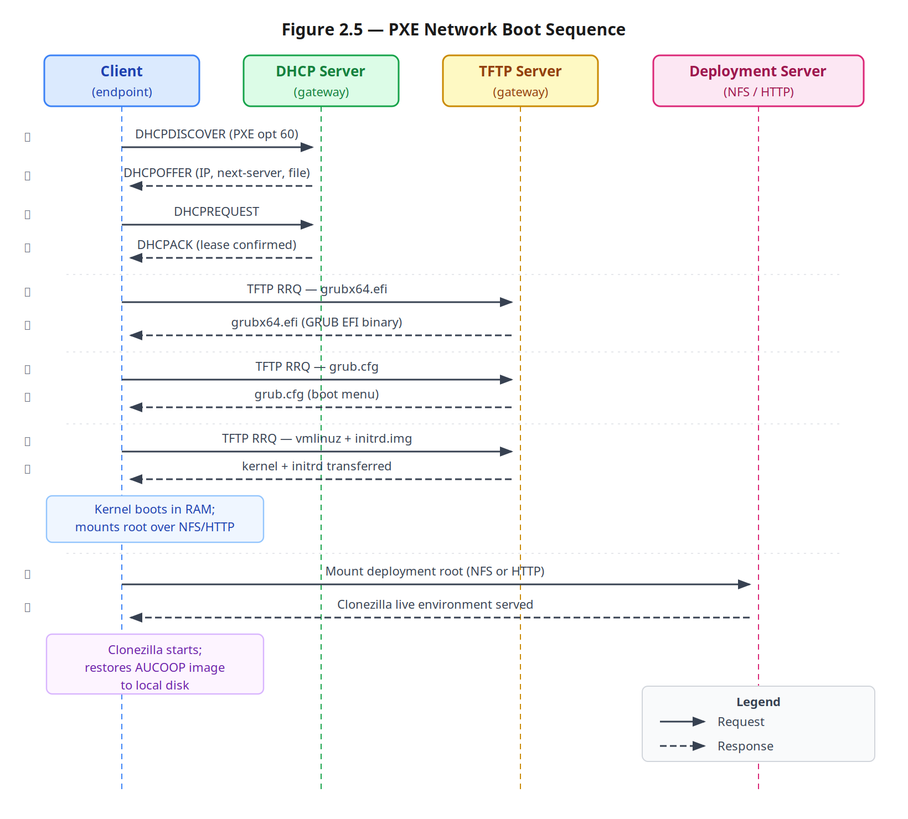

# 3. Methodology / Project Development
<!-- \label{ch:methodology} -->

> The bulk of the thesis. Three coordinated work-streams: **3.A** the network, **3.B** the endpoints, **3.C** the knowledge artefact. Maps to LaTeX section *Methodology / project development*.

---

## 3.A Network hardware deployment
<!-- \label{sec:methodology-network} -->

This part of the chapter describes the hardware-network work-stream: how the
physical and link layers of a small community network are designed,
specified, and brought up in a low-resource site. The narrative is
deliberately ordered as a deployment would be ordered in the field, but it
is grouped under a four-layer model — *field*, *site*, *endpoint
touchpoint*, *power and enclosure* — borrowed from the functional layering
proposed in the companion thesis [Motje, 2026]. Adopting the same layer
vocabulary on the hardware side and on the software/services side keeps the
two theses, and the handbook that backs them, internally coherent: every
recipe in `docs/3-Guide/` of the handbook can be located in exactly one
layer, and every artefact named below has a one-to-one counterpart in the
handbook.

The material is also organised around three validation lenses that recur in
§4: **coverage** (does the layer reach where it needs to reach?),
**sufficiency** (does it carry the expected load with margin?), and
**adaptation** (does the recipe survive being executed by a different team
in a different site?). Where a design choice trades one lens against
another, the trade-off is named explicitly.

### 3.A.1 The four-layer model

The hardware deployment is decomposed into four functional layers. Each
layer owns a small set of decisions, a recommended bill of materials, and a
matching family of recipes in the handbook.

| Layer | Owns | Handbook section | Examples of artefacts |
|---|---|---|---|
| **Field** | Inter-building radio links, long-distance bridges, outdoor antennas | `3-Guide/Antennas/` | Point-to-point Ubiquiti links, line-of-sight surveys |
| **Site** | Indoor coverage, mesh backbone, IP plan, switching, boundary L3/L4 services | `3-Guide/Network-Planning/`, `IP-Addressing/`, `Wireless-Mesh/` | OpenWrt routers, 802.11s mesh, DHCP/DNS on the gateway |
| **Endpoint touchpoint** | The network-side of laptop/desktop provisioning | `3-Guide/Laptop-Deployment/` (network parts only) | Isolated PXE subnet, deployment switch, on-site DHCP/TFTP/NFS |
| **Power & enclosure** | Mains, UPS, surge protection, mounting, cabling, labelling | `3-Guide/Power-and-UPS/` | UPS sizing, cable management, panel labelling |

Table: Four-layer network hardware model and corresponding handbook sections

The endpoint-touchpoint layer is intentionally split from the *endpoint*
work-stream described in §3.B. Section §3.B owns the laptop as a managed
asset (image, partitions, user account); §3.A only owns the network plumbing
that is required during a mass deployment. The split mirrors the SW/HW
split between this thesis and the companion thesis: a deployment is a
single event, but the underlying responsibilities can be assigned cleanly.

The remainder of §3.A walks through these four layers in the order in which
they are typically commissioned: a *site assessment* that constrains all
later choices (§3.A.2), the **site layer** itself (§3.A.3 to §3.A.5), the
**field layer** (§3.A.6), the **endpoint touchpoint** (§3.A.7), the
**power and enclosure layer** (§3.A.8), and the **boundary services** that
are kept in scope (§3.A.9). The part closes with the cross-cutting
practices that experience showed are not optional (§3.A.10) and the
explicit lessons-to-handbook flow that motivated the recipes
(§3.A.11).

### 3.A.2 Site and internet assessment

No layer can be designed without first characterising the site. The method
codified in `3-Guide/Network-Planning/` has three phases, each with a
corresponding deliverable:

1. **Internet assessment.** What ISP options exist, what speed and latency
   the existing uplink actually delivers, and whether a different
   technology (fibre, cable, ADSL, 4G/5G, LEO satellite) is reachable at
   reasonable cost. The deliverable is a comparison table scored against
   the eight criteria in `1-Internet-Assessment.md` (download/upload,
   data cap, reliability, latency, local support, contract length, budget
   fit, expected user load). The Namibia deployment inherited a
   government-supplied ADSL link and skipped the change-of-provider
   branch; the methodology still required documenting the alternatives,
   which is what allows a future team to revisit the choice.
2. **Site assessment.** A walkthrough with a Wi-Fi analyser
   (LinSSID/WiFiman) producing a coverage heatmap with three bands
   (≥ −50 dBm, −70 to −80 dBm, ≤ −80 dBm), a baseline speed test repeated
   at different times of day, and an annotated site map (overhead imagery
   plus on-site sketch) marking entry point, target rooms, obstacles,
   distances, and power outlets. This map is the single most important
   artefact produced before any equipment is purchased.
3. **Expansion planning.** A decision tree (Ethernet + APs vs mesh vs
   point-to-point antennas) driven by *building topology, cabling
   feasibility, and inter-building distance*, not by personal preference.

The methodological commitment is that the site survey produces a written
record, not a recollection. Every later decision in §3.A.3 to §3.A.8 cites
this record. This is the first concrete answer to the *knowledge
volatility* problem named in §1.2: the site assessment of one team becomes
the starting context of the next.

### 3.A.3 Hardware selection at the site layer

The bill of materials for the site layer is constrained by four criteria,
applied in order:

1. **OpenWrt support** with mesh-capable Wi-Fi packages. The router must be
   on the OpenWrt Table of Hardware with a current snapshot or release,
   and it must have enough flash and RAM to host `wpad-mesh-wolfssl`
   alongside the default LuCI stack (in practice ≥ 16 MB flash, ≥ 128 MB
   RAM, dual-band radios).
2. **Affordability and local availability.** Equipment that can be replaced
   in country, or shipped without customs friction, beats marginally
   better equipment that cannot.
3. **Power flexibility.** 12 V / USB-C devices integrate with a small UPS
   without a per-router AC brick.
4. **Footprint.** A consumer plastic enclosure that mounts on a wall with
   two screws is preferred over a 19" rack device for primary-school
   environments.

The default pick that satisfies all four criteria at the time of writing is
the **Cudy WR3000E** (Wi-Fi 6, dual-band, OpenWrt-supported, ~45 €/unit,
12 V input). For deployments that need a more capable gateway with two
Ethernet interfaces, USB 3.0, and headroom for VPN and on-router services,
the **NanoPi R-series** is the chosen alternative; it is the same family
that the companion thesis uses for service hosting [Motje, 2026], which
keeps the on-site hardware vocabulary uniform across the two work-streams.

A pitfall worth naming: a router that *technically* supports OpenWrt at
release N may be impractical if the snapshot images regress on the model's
specific Wi-Fi driver. Two days were lost in early bring-up to a snapshot
build that broke 5 GHz on the WR3000E; the recipe in
`Wireless-Mesh/1-Static-IP-Mesh/index.md` therefore pins the tested
versions of OpenWrt and `wpad-mesh-wolfssl` and cautions the reader that
"newer is not necessarily better".

### 3.A.4 IP addressing plan

The IP plan is the most under-valued artefact of a small network, and the
one whose absence costs the most when something breaks. The handbook
recipe `3-Guide/IP-Addressing/index.md` codifies four methodological
commitments:

- **Use a non-default `/24`** (the deployments documented here use
  `192.168.70.0/24`). Default ranges (`192.168.1.0/24`, `192.168.0.0/24`)
  collide the moment a second consumer router is plugged in for tests, or
  a contractor's device with the same default range is brought to site.
  RFC 1918 leaves an enormous private space; using it removes a recurring
  source of accidental conflicts.
- **Reserve the low part of the range for infrastructure** (`.1` for the
  gateway, `.2`–`.20` for routers and APs, `.21`–`.99` for fixed servers
  and printers) and the high part for DHCP-assigned client devices
  (`.100`–`.200`). The split is arbitrary but stable, and a single glance
  at an IP tells the operator what kind of device they are dealing with.
- **Document the plan in a versioned spreadsheet** with one row per device:
  hostname, role, location, MAC, IP, allocation method (static / DHCP
  reservation / DHCP pool). The spreadsheet lives in the project repository
  and is updated *at the moment of provisioning*, not afterwards.
- **Prefer DHCP reservations over hand-coded static IPs** wherever the
  device supports DHCP-client mode. This is the substance of the second
  iteration of the mesh setup (§3.A.5): static IPs survive only as long
  as the team that wrote them is around, while a DHCP table on the
  gateway is self-documenting and survives turnover.

The IP-conflict episode of Day 8 in Gochas, in which a newly added router
silently misrouted traffic until a missing static-route entry was found,
is the empirical justification for these commitments. It cost roughly an
hour of debugging for what was a five-minute fix once the problem was
named — the handbook recipe explicitly calls this out under
"Common Mistakes" so that the next operator skips the hour.

### 3.A.5 Wireless mesh design at the site layer

Indoor coverage of a multi-room or multi-building site without trenching
cable is met with an IEEE 802.11s mesh on OpenWrt. The handbook codifies
the design as **two iterations** that are meant to be done in sequence,
not chosen between (`3-Guide/Wireless-Mesh/index.md`):

- **Iteration 1 — static-IP mesh.** Each satellite router gets a unique
  static LAN IP, its DHCP server is disabled, the default `wpad-basic-*`
  package is replaced with `wpad-mesh-wolfssl`, and a 5 GHz 802.11s
  backhaul is brought up alongside a shared 2.4 GHz access point. This is
  the simplest configuration that confirms the mesh links form, that
  satellites bridge correctly, and that clients roam between APs sharing
  the same ESSID, encryption, and key. Iteration 1 is the recommended
  starting point for *every* deployment because it isolates the
  link-formation problem from the IP-management problem.
- **Iteration 2 — DHCP-based mesh.** Once the mesh is stable, each
  satellite is converted to a DHCP client of the main router, with WAN
  and the firewall disabled, and its address pinned by a static lease on
  the gateway. This centralises IP management on one device, makes
  onboarding new satellites a matter of plugging them in, and removes a
  whole class of long-term operational problems caused by hand-edited IP
  tables drifting out of date.

The methodological choice of *layering* the iterations rather than
presenting them as alternatives is itself a deliberate didactic device:
new operators learn the system by building it incrementally, and they
acquire diagnostic intuition (what fails when DHCP is misconfigured vs
when the mesh ID is mistyped) that they would not acquire by copy-pasting
the final state.

The radio design splits the two bands by role:

- **5 GHz** carries the mesh backhaul on a fixed channel (typically 44),
  20 MHz or 40 MHz wide, in 802.11s mode with WPA3-SAE encryption.
  Narrower channels penetrate walls better at the cost of throughput; in
  small primary-school deployments the throughput ceiling is set by the
  uplink, not the backhaul, so 20 MHz is the safe default.
- **2.4 GHz** carries the client access point on a non-overlapping channel
  (1, 6, or 11) with WPA2-PSK by default, escalating to WPA2/WPA3 mixed
  mode only after the client device population is known. The Gochas
  deployment hit a WPA3-only incompatibility on a single laptop on Day 6
  and was reconfigured to mixed mode within minutes; the handbook now
  recommends mixed mode by default for any site with unknown client
  hardware.

### 3.A.6 Field-layer point-to-point links

When two buildings are more than ~50 m apart or separated by structures
that block 2.4/5 GHz, the mesh stops being adequate and a dedicated
point-to-point (PtP) link at the field layer takes over. The handbook
section `3-Guide/Antennas/` is currently a stub and is one of the
deliberate WIP markers acknowledged in §1.4. The methodological intent,
already fixed, is:

- Use Ubiquiti airMAX or LiteBeam-class equipment (or equivalent) chosen
  by Ubiquiti Design Center / LinkPlanner against a real terrain profile
  rather than a rule of thumb.
- Conduct an explicit line-of-sight visibility test before mounting,
  including Fresnel-zone clearance.
- Mount, align, and link-test in two passes — coarse alignment from the
  signal-strength meter, fine alignment from the throughput test.
- Document the link as a pair of devices with their own subnet entries in
  the IP plan of §3.A.4.

The Gochas deployment did not exercise this layer (the school's buildings
are within mesh range), so the recipe is documented from the network
planning context and from the literature rather than from a fresh field
event. This honest framing is part of the validation discussion of §4.

### 3.A.7 Endpoint touchpoint — the deployment subnet

A laptop mass-deployment (§3.B) requires its own short-lived network: an
isolated Ethernet segment carrying DHCP, TFTP, and NFS for PXE boot, plus
the Clonezilla rootfs and the disk image. From the §3.A perspective, this
network has three hardware requirements:

1. A **gigabit unmanaged switch** with one port per target machine plus
   one port for the PXE server. Nine ThinkPads in Gochas were served by a
   single 16-port switch.
2. **Strict isolation from the production LAN** during the imaging
   window. The deployment subnet runs its own DHCP server (the PXE
   server's `isc-dhcp-server`) which would conflict with the gateway's
   DHCP if both were reachable on the same broadcast domain.
3. **A planned IP range that does not overlap the production plan**
   (`10.10.10.0/24` was used in Gochas against the production
   `192.168.70.0/24`), so a misconnected cable does not silently bridge
   the two networks.

The corresponding services (DHCP scope, TFTP root, NFS export) belong to
§3.B; their hardware substrate belongs here.

### 3.A.8 Power and enclosure

Power is the failure mode that no software can mitigate. The site
assessment of §3.A.2 records a load inventory for each candidate
deployment site:

- Mesh router: ~5 W steady, ~10 W peak (per node).
- PoE switch (if used): ~10–20 W plus per-port PoE budget.
- Mini-PC / NanoPi gateway: ~5–15 W steady.
- Optional UPS standby loss: ~5 W.

At a small site (one gateway, one switch, four to seven mesh nodes), the
total steady draw is in the 50–100 W range, which puts a 600–800 VA
consumer UPS in the right size class for ~30 min of bridging during short
outages and, more importantly, for graceful shutdown on longer outages.
The recurring power cuts in Gochas (sometimes lasting days, with the
town's communication tower turning off at 20:00 by design) confirmed that
*riding through* outages is not a realistic goal at this site class; the
realistic goal is *graceful shutdown and clean restart*, which the chosen
sizing supports. The companion thesis [Motje, 2026] develops the
graceful-shutdown integration on the services side via NUT; §3.A only
guarantees that the hardware can survive a sudden cut without data loss
on the network devices themselves (OpenWrt's flash layout makes this
trivially true on the router side; the gateway PC is the device that
needs the UPS).

Enclosure and mounting are mundane and decisive. The convention adopted
in the handbook recipe (currently a stub at `3-Guide/Power-and-UPS/`) is:
mount above head height to clear furniture and people; choose locations
with a power outlet within ~2 m to avoid extension-cord chains; label
every cable on both ends with a printed tag bearing the device hostname;
photograph the panel after every change.

### 3.A.9 Boundary services kept in scope

The hardware work-stream owns the *minimum* set of L3/L4 services without
which the network is not usable. Three services qualify:

- **DHCP on the gateway.** A single `dnsmasq` instance (the OpenWrt
  default) serving the production scope, with static leases for every
  infrastructure device named in §3.A.4. The SW/HW boundary is drawn
  here: configuration of `dnsmasq` on the gateway is in scope; richer
  DHCP servers, DHCP relays across VLANs, and IPAM tooling are in
  [Motje, 2026].
- **DNS forwarding on the gateway.** Again `dnsmasq` in its forwarder
  role, with the gateway's own DNS servers (typically `1.1.1.1` and
  `9.9.9.9`) as upstream. Local-name resolution for the infrastructure
  devices is configured by the same static-lease entries.
- **A monitoring overview on the gateway.** Only the *minimum* needed to
  answer "is the mesh up, are the satellites reachable, is the uplink
  alive": LuCI's built-in `Status → Wireless` and `Status → Routes`,
  plus ping-based checks scriptable from the gateway. Full Zabbix
  agentful monitoring is software work and is owned by [Motje, 2026]; the
  hardware-side commitment is to expose the SNMP and ping endpoints that
  the monitoring stack consumes.

This boundary is drawn explicitly so that no aspect of the deployment
falls between the two theses uncovered.

### 3.A.10 Cross-cutting operational practices

A handful of practices are not specific to any one layer but apply across
all of them. They are codified in the handbook's general rules and
repeated in the site-deployment recipes because their cost of omission is
high:

- **Label every cable on both ends.** A two-letter site code plus the
  destination hostname is enough.
- **Photograph every panel** before and after a change. The photo is
  attached to the project log entry.
- **Keep a one-page outage runbook** at the site (laminated A4),
  containing: gateway IP and admin credentials reset procedure, the IP
  plan, the wiring diagram, and the contact of the maintainer of record.
- **Carry a spares kit** sized to one of each critical device
  (one router, one switch, one PoE injector if applicable, two pre-made
  Ethernet cables of common lengths). The kit lives at the site, not
  in Barcelona.
- **Pin firmware and package versions** in the recipe and verify them
  during bring-up. The "newer is not necessarily better" rule of §3.A.3
  applies here too.

These practices are mundane on purpose. Their value is exactly that they
do not require the operator to remember anything in the moment.

### 3.A.11 Lessons learned and inputs to the handbook

The hardware-network deployments described in §4 produced a set of
lessons that landed directly as recipes, admonitions, or cross-references
in the handbook. Naming them here makes the §3 → handbook → §4 loop
explicit.

**The IP plan is a deliverable, not a side-effect.** The Day-8 conflict
episode in Gochas is the reason `3-Guide/IP-Addressing/index.md` opens
with a "why a non-default range matters" section and why every router
recipe asks the reader to update the spreadsheet *at the moment of
provisioning*.

**Mesh setup is two iterations, not one.** The decision to split the
mesh recipe into a static-IP first pass and a DHCP-based second pass
came directly from the observation that operators who tried to go to
the DHCP-based design first lost time on link-formation failures that
were not in fact caused by DHCP. The two recipes
(`Wireless-Mesh/1-Static-IP-Mesh/`, `Wireless-Mesh/2-DHCP-Mesh/`) are
the codification of that lesson.

**Pin the OpenWrt and `wpad-mesh` versions.** The `Used Versions` table
at the top of the static-IP-mesh recipe exists because two days of early
bring-up were lost to a snapshot regression. Future operators are warned
that they may need to roll back if a fresh snapshot misbehaves, and they
are pointed to the issue tracker.

**Mixed-mode WPA2/WPA3 by default until clients are known.** The Day-6
WPA3-only incompatibility is named in the recipe under "Wireless
Security" so the next deployment does not repeat it.

**Power planning is for graceful shutdown, not ride-through.** The
recurring outages in Gochas reframed the UPS goal and that reframing is
now embedded in the (still stub) `3-Guide/Power-and-UPS/` section. The
handover to [Motje, 2026] for NUT integration is explicit.

**The site survey is a versioned artefact.** The methodological
commitment that "every later decision cites this record" is inherited
from §3.A.2 and is repeated as a rule in `Network-Planning/index.md`.
A site survey kept only in someone's head does not count.

These lessons are revisited in §4 against the three validation lenses
(coverage, sufficiency, adaptation) and in §7 as part of the
per-objective check.

---

## 3.B Endpoint reconditioning and mass deployment
<!-- \label{sec:methodology-endpoint} -->

This part of the chapter describes the second hardware work-stream: how a
batch of refurbished laptops is taken from incoming-equipment status to
classroom-ready endpoints with a single, reproducible image. The
narrative is again ordered as a deployment is ordered in the field, but
the underlying methodological commitments are the same as those of §3.A:
written artefacts over recollection, recipes that survive a change of
operator, and explicit lessons looped back into the handbook.

§3.B owns the laptop as a managed asset (the image, the partitions, the
user account, the BIOS posture). The network plumbing that the
deployment briefly needs (the isolated PXE subnet, the deployment
switch, the DHCP/TFTP/NFS hardware footprint) is owned by §3.A.7. Anything
beyond first boot — fleet management, identity, application updates,
remote support — belongs to the companion thesis [Motje, 2026].

### 3.B.1 The refurbished-hardware case

The starting point is the observation that the bottleneck for digital
inclusion in low-resource sites is rarely *new* hardware. Corporate
fleet refreshes, NGOs such as **Labdoo**, and local sponsors put
three- to seven-year-old business laptops back into circulation by the
container-load; the limiting factor on their reuse is not the silicon
but the *labour cost of imaging them one by one* and the *cost of a
support contract for a fleet of mismatched configurations*. The
methodological response of this work-stream is therefore not "find better
hardware" but "drive the per-machine provisioning cost as close to zero
as possible while keeping the resulting fleet uniform enough to support
remotely".

Two sourcing channels were exercised in the deployments documented in
§4. Labdoo provided nine Lenovo ThinkPads (T460 and X260, Intel i5-6200U,
8 GB DDR4, mixed 238 GB SSD / 466 GB HDD) wiped and ready to receive a
new OS. NexTReT contributed three additional laptops and two mini-PC
servers from a Spanish fleet refresh. Both channels deliver hardware in
the *same generation class* but with *non-identical disk geometries* —
which, as §3.B.5 will show, is the single decision driver of the entire
imaging workflow.

The case for refurbished hardware is also a sustainability one along
all three dimensions. Environmentally, a laptop manufactured five
years ago and reused for another five years has a markedly lower
lifecycle carbon footprint per useful year than a newly-manufactured
equivalent. Socially, the donation pipeline channels institutional
fleet refreshes into ICT access for sites that could not otherwise
afford it. Economically, the refurbishment-spend per donated unit is
a small fraction of the secondary-market value mobilised. The
argument is developed in §6, which adopts the three-indicator framing
of [Roura et al., 2026] and applies it to the deployment.

### 3.B.2 Intake, triage and inventory

Before any laptop receives the golden-master image, it goes through a
short triage step that produces an inventory record. The fields captured
per machine are deliberately minimal so the workflow does not become its
own bottleneck:

| Field | Source | Why |
|---|---|---|
| Manufacturer / model / serial | Sticker or `dmidecode -s system-serial-number` | Traceability, warranty |
| CPU / RAM | `lscpu`, `free -h` | Software-baseline check |
| Storage device + size | `lsblk -d -o NAME,SIZE,ROTA` | **Drives the imaging plan** |
| Battery health | `upower -i $(upower -e \| grep BAT)` | Field viability |
| BIOS posture | Manual: Secure Boot off, USB boot on, network boot on | Pre-deployment requirement |
| Notes | Free text | Visible defects, dead keys, screen marks |

Table: Endpoint intake inventory fields

The inventory is held in the same project repository as the IP plan of
§3.A.4, in a comma-separated file with one row per machine. The
deployment script consumes this file when matching disks to image
variants (§3.B.5). For larger or longer-running operations, a tool such
as **DeviceHub** can replace the spreadsheet without changing the
methodology — what matters is that the inventory exists and is
versioned, not which tool produces it.

The triage step also enforces a one-time **BIOS posture** that every
target machine must reach before it joins the deployment queue: Secure
Boot disabled, network boot enabled in the boot order, USB boot enabled
as a fallback. This posture is why §3.B.7 succeeds at scale; skipping it
is the single most expensive mistake an inexperienced operator can make
(see the lessons of §3.B.9).

### 3.B.3 The golden-master image — AUCOOP Linux Mint

The reference operating system installed on every endpoint is **Linux
Mint 22.3 Cinnamon**, customised for community use. The reasoning is
documented in `3-Guide/Laptop-Deployment/AUCOOP-image.md` and reduces to
three observations.

First, the alternative operating systems each fail one constraint that
matters for this user population. Windows is licensed and runs poorly
on the target hardware class; Ubuntu's GNOME and Snap-centric desktop is
unfamiliar to users coming from Windows and increases first-use
friction; rolling-release distributions impose a maintenance burden that
the receiving institution cannot absorb. Linux Mint Cinnamon presents a
Windows-style desktop (start menu in the bottom-left, taskbar with
launchers, system tray on the bottom-right) on top of an LTS Ubuntu
base, which keeps user training cost and security-update cadence both
manageable.

Second, the *customisation* is itself a methodological deliverable, not
a matter of taste. The AUCOOP image ships with **OnlyOffice** as the
office suite (chosen for its high fidelity to the Microsoft Office file
formats teachers already produce), with familiar launcher icons named
after the closest Microsoft equivalent (Word, Excel, PowerPoint), and
with the default unused applications removed. The user account
(`aucoop`, with a documented password) is generic on purpose: the
endpoint is delivered as a *station* the school can assign to a child or
a teacher, not as a personal device tied to the contributor who imaged
it.

Third, the master is captured with a strict pre-capture cleanup
checklist: `apt clean`, `apt autoremove`, removal of thumbnail caches,
truncation of `journalctl` logs, removal of the network-manager
connection history, and a final fill-with-zeros of the free space so
gzip compression of the captured image is dense. Skipping the cleanup
inflates the image by a factor of two to three with no functional gain.

### 3.B.4 Image capture with Clonezilla

The captured artefact is a **Clonezilla image** of the master disk,
produced from a Clonezilla Live USB booted on the master machine. The
operative choices are:

- `device-image` mode: the source is a block device, the destination is
  an image directory.
- `local_dev` repository: an external USB drive or HDD physically
  separate from the source disk (writing the image to the same disk
  being read is unsupported and would corrupt the result).
- `savedisk`: the entire disk is captured, not just the root partition,
  so the GPT, the EFI system partition, and the root partition are all
  preserved as a self-contained set.
- gzip compression at the default level: a typical Linux Mint master
  with ~12 GB of used data on a 466 GB disk produces a ~4 GB compressed
  image directory.

The image directory layout is meaningful. It contains one
`*-ptcl-img.gz` file per partition (e.g.
`sda1.vfat-ptcl-img.gz`, `sda2.ext4-ptcl-img.gz`), partition-table
dumps in `parted` and `sgdisk` formats (`sda-pt.parted`,
`sda-gpt.sgdisk`), a `parts` listing, and a `disk` descriptor. The
recovery side (§3.B.7) reconstructs the geometry from the dumps before
restoring the partition data. Treating the image as a *named, versioned
artefact* with a date-bearing directory name (`aucoop-mint22.3-2026-03`)
is what makes the per-deployment provenance trail of §4 possible.

### 3.B.5 The partition-resize problem (and the fix)

The technical core of this work-stream is a problem that does not appear
when all target disks are the same size and is unavoidable when they
are not. It is described here in full because (i) it has cost more
field-debugging time than any other issue in the deployments documented
in §4, and (ii) it is the kind of failure that mainstream tutorials skip
and on-site teams therefore re-discover the hard way.

**The symptom.** A Clonezilla image captured from a 466 GB HDD and
restored to a 238 GB SSD fails roughly 77 % of the way through with:

```
target seek ERROR: Invalid argument
```

**The cause.** Clonezilla preserves the source partition layout in the
image. When restoring, `partclone` writes data blocks at the same
offsets at which they appear in the source filesystem. The ext4
filesystem scatters its metadata — block-group descriptors, inode
tables, block bitmaps, inode bitmaps — across the *entire* partition,
not only the populated region. A 466 GB ext4 partition therefore has
metadata blocks at offsets up to ~466 GB even when the filesystem holds
only 12 GB of data. When the target partition is smaller than the source
*partition* (not the source *data*), the seek to the high-offset
metadata block lands beyond the device boundary and `partclone` aborts.

**Why the obvious flags are not enough.** Two flags from the `ocs-sr`
manual look as if they should solve this: `-k1` (proportionally resize
target partitions) and `-icds` (skip the destination-disk-too-small
check). They do not. `-k1` operates on the partition layout but cannot
move metadata blocks already laid out at high offsets in the source
ext4 filesystem; `-icds` only suppresses the up-front check, it does
not prevent the runtime seek failure.

**The fix.** The partition layout itself must be made physically smaller
than the smallest target disk, on a copy of the master, before the
image is recaptured. The four-step procedure is mandatory and
order-sensitive:

1. `e2fsck -fy /dev/<source>` — force a clean filesystem before
   resizing. The resize tools refuse to operate on a dirty filesystem.
2. `resize2fs /dev/<source> 20G` — shrink the **filesystem** to a size
   chosen to be larger than the actual data (12 GB → 20 GB gives
   margin) but smaller than the smallest target disk (238 GB).
3. `parted /dev/<sourcedisk> resizepart <N> 22100MB` — shrink the
   **partition** to slightly larger than the filesystem, accounting for
   the partition start offset.
4. `e2fsck -fy /dev/<source>` again — verify that the filesystem
   survived the partition shrink.

Then the image is recaptured with `partclone` directly
(`partclone.vfat` for the EFI system partition,
`partclone.ext4` for the root partition), and the partition-table dumps
are regenerated with `parted`, `sgdisk`, `sfdisk`, and `blkid`. The
result is a smaller image (~3.6 GB compressed) that restores cleanly to
both 238 GB SSDs and 466 GB HDDs.

The work happens once, off-line, on a workstation in Barcelona, against
a `qcow2` copy of the master disk attached via `qemu-nbd`; doing it
on-site against the original master is risky and slow. The recipe in
`3-Guide/Laptop-Deployment/index.md` codifies the off-line workflow as
**Phase 3** of the deployment and gates it behind a clearly-marked
"skip if all disks are the same size" admonition so operators do not
incur the work for deployments that do not need it.

The order of operations is the part that bites. Shrinking the partition
*before* the filesystem truncates the filesystem and destroys data; the
recipe states this in a `!!! warning` box for the same reason as the
matching warning in `Wireless-Mesh/1-Static-IP-Mesh/`: a single
sentence at the right place saves a multi-hour recovery later.

### 3.B.6 PXE server architecture

A PXE deployment runs three services on a single host on the isolated
deployment subnet of §3.A.7:

| Service | Port | Package | Role |
|---|---|---|---|
| DHCP | 67 | `isc-dhcp-server` | Issue IP, point client at the boot file |
| TFTP | 69 | `tftpd-hpa` | Serve GRUB EFI binary, kernel, initrd |
| NFS | 2049 | `nfs-kernel-server` | Serve the Clonezilla rootfs and the image directory |

Table: PXE server services, ports, and packages



*Figure 3.1 — PXE network boot sequence. The client exchanges DHCP to obtain an IP and the boot-file location, then fetches the GRUB EFI binary and configuration via TFTP, and finally mounts the Clonezilla live environment from the NFS/HTTP server. Solid arrows = requests; dashed arrows = responses.*

The PXE host is itself one of the deployed laptops or a small mini-PC;
it does not need server-class hardware. In Gochas, one of the
ThinkPads earmarked for the school was reassigned as PXE host for the
duration of the imaging session and then re-imaged from the same
deployment as its last action.

**GRUB EFI generation.** The bootloader served via TFTP is generated by
`grub-mknetdir --net-directory=/tftpboot/nbi_img --subdir=/grub`, which
emits `core.efi` plus the GRUB modules and font. The EFI binary is then
copied as `bootx64.efi` at the TFTP root because that is the filename
UEFI firmware expects when a DHCP `filename` option is presented for a
UEFI client (DHCP option 93 architecture `00:07` or `00:09`).

**Two copies of the kernel, on purpose.** The Clonezilla `vmlinuz` and
`initrd.img` exist in *two* directories: under `/tftpboot/nbi_img/`
(served via TFTP, fetched by GRUB during boot) and under
`/tftpboot/clonezilla/` (served via NFS, mounted by the running
kernel as its root). The duplication is necessary because `tftpd-hpa`
runs in `--secure` mode, which chroots the TFTP server to its root
directory and refuses to follow symlinks pointing outside; placing the
files where each service can actually serve them is simpler and more
robust than trying to defeat the chroot.

**DHCP scope.** A small `/24` is enough (`10.0.0.0/24` in Gochas), with
the PXE host on `.1`, a short DHCP range (`.101`–`.120`) for clients,
and a `next-server` pointer back to `.1`. The architecture-conditional
`filename` directive is the part that makes the same DHCP scope work
for both UEFI and legacy-BIOS clients without re-configuration.

### 3.B.7 Auto-restore script and Secure Boot handling

Once GRUB loads, the operator should not be asked to make any choices.
The default GRUB menu entry calls a single `auto-restore.sh` script
served from the NFS-exported image directory. The script:

1. **Detects the target disk.** Probes `/dev/nvme0n1` then `/dev/sda`
   then `/dev/vda`, in that order, and selects the first present block
   device. This is what makes the same image and the same kernel
   command line work across machines with NVMe SSDs and SATA HDDs
   without per-machine configuration.
2. **Invokes `ocs-sr`** with the flags the recipe pins:

   ```
   ocs-sr -g auto -e1 auto -e2 -r -j2 -icds -k1 -scr -p reboot \
     restoredisk "$IMAGE_NAME" "$DISK"
   ```

   The relevant flags are `-k1` (proportional partition resize),
   `-icds` (skip destination-size check — safe now that the image of
   §3.B.5 fits), `-scr` (skip restorability check), and `-p reboot`
   (reboot when done so the operator only has to power-cycle once).
3. **Reboots into the deployed OS.** The newly-imaged disk is now the
   first boot device and Linux Mint comes up with the `aucoop` user
   ready to log in.

**Secure Boot.** The single biggest field-debugging cost across the
deployments was the silent failure mode of UEFI firmware presented with
an unsigned `bootx64.efi`: the firmware downloads the binary, *silently*
discards it, and falls through to the next entry in the boot order
(typically IPv6 PXE, which times out). There is no error message on
screen and the only diagnostic clue is the silence itself. The recipe
gates the entire deployment on a one-time BIOS step (Step 14: disable
Secure Boot on every target machine before imaging) and the lessons
list of §3.B.9 elevates this to an inventory-time check in §3.B.2 so
the failure cannot recur. Secure Boot may be re-enabled after
deployment if the receiving institution's policy demands it; the
deployed Linux Mint does support it.

### 3.B.8 Quality control and user handover

The last step before a machine leaves the imaging table is a short
quality check, performed in the order in which the failures it catches
typically appear:

1. The machine boots from the local disk to the Linux Mint login
   screen unaided (no PXE, no USB).
2. The `aucoop` user logs in with the documented password.
3. Wi-Fi can associate to the production network of §3.A.5 and reach
   the internet.
4. OnlyOffice opens a sample document and renders it correctly.
5. The hostname matches the inventory record of §3.B.2.

A failed check sends the machine back to the corresponding step (a
boot failure to §3.B.5, an image-content failure to §3.B.3, a network
failure to §3.A.5) rather than triggering an ad-hoc fix on the
individual machine. The discipline is what keeps a fleet of nine or
twelve laptops actually identical at handover.

Handover to the receiving institution adds a short briefing — how to
log in, how to reach Wi-Fi, where the printed runbook is, who to
contact — and a written record that the machine has been delivered.
End-user training at depth is out of scope for this thesis; what is in
scope is delivering machines whose default configuration does not
require that training to be useful.

### 3.B.9 Lessons learned and inputs to the handbook

As in §3.A, the laptop deployments produced a set of lessons that
landed directly in the handbook. They are listed here because each one
points to a specific change the next operator should not have to
re-discover.

**Secure Boot is an inventory-time check, not a debug-time discovery.**
The hours lost to silent UEFI rejection of an unsigned GRUB binary
turned this from a recipe footnote into the gating BIOS posture of
§3.B.2 and a `!!! warning` admonition at the top of the PXE recipe.

**The partition-resize problem deserves its own phase.** The
`target seek ERROR` failure was the reason `3-Guide/Laptop-Deployment/`
was reorganised into four explicit phases (prepare, capture, resize,
deploy) rather than a single linear list of steps. Operators with
uniform-disk fleets skip Phase 3 entirely; operators with mixed disks
know exactly which phase to read.

**`tftpd-hpa --secure` does not follow symlinks.** This single
sentence is now a `!!! warning` in the recipe; without it, an operator
who tries to keep one canonical copy of the Clonezilla files and
symlink the rest sees TFTP serve nothing and has no obvious diagnostic.

**Auto-detect the target disk.** Hard-coding `/dev/sda` in the restore
command works on every ThinkPad with a SATA disk and fails on every
ThinkPad with an NVMe SSD. The auto-detection script in §3.B.7 was
written after the first NVMe machine refused to image; it is now the
default in the recipe.

**Use `-k1 -icds -scr -p reboot` together with a resized image, not
instead of one.** These flags relax `ocs-sr`'s safety checks but do not
fix the underlying ext4 layout problem of §3.B.5. The recipe states
this explicitly so the next operator does not lose a day chasing flag
combinations that cannot work.

**A simple stack beats DRBL for this fleet size.** A full DRBL
deployment is overkill for nine or twelve machines and adds a layer of
debugging that an on-site team cannot afford. The recipe is built on
plain `isc-dhcp-server` + `tftpd-hpa` + `nfs-kernel-server` +
Clonezilla Live precisely so that every component can be inspected and
restarted independently when something misbehaves. DRBL becomes
attractive at a different fleet size; that is a future-work note in
§7.

**The image is a versioned artefact.** Naming the image directory
`aucoop-mint22.3-2026-03` and storing both the `qcow2` master copy and
the resized image in the project repository is what allows §4 to claim
that *this specific image* was deployed at *this specific site on this
specific date*. The companion thesis [Motje, 2026] inherits the same
naming convention for service-side artefacts.

These lessons feed into the §4 validation against the three lenses
(coverage: did every target laptop receive the image?; sufficiency: did
the resulting fleet meet the school's actual usage in the days that
followed?; adaptation: could a second team in a different site execute
the same recipe?) and into the per-objective check of §7.

---

## 3.C The AUCOOP Handbook as a knowledge artefact
<!-- \label{sec:handbook} -->

The two preceding parts of this chapter (§3.A and §3.B) describe *what* was
deployed in the field. This third part describes *how the deployment knowledge
itself is preserved* so that the next student, the next volunteer, or the next
partner association does not have to start again from a blank page. It is the
most original contribution of this thesis: not a single network or a single
classroom of refurbished laptops, but a reusable instrument — the **Community
Network Handbook** — capable of producing many of them.

The handbook is hosted at <https://github.com/aucoop/Community-Network-Handbook>
and published as a static website plus a downloadable PDF. The thesis writes
*about* the handbook; the handbook itself is the durable deliverable.

### 3.C.1 Why a living handbook

§1.2 framed the problem of *knowledge volatility* in a volunteer association.
AUCOOP runs on bachelor and master students who join, contribute for one or two
academic years, graduate, and leave. Every project — Namibia 2024, Namibia
2026, the local pilots in Barcelona — produced internal documents (PDFs,
slide decks, hand-written field notes) that ended up in shared drives that
nobody opens once the contributors are gone. The next team rediscovers the
same DHCP option, the same OpenWrt mesh quirk, the same Clonezilla
`partclone target seek ERROR`, and pays the same debugging tax.

A living handbook reverses this dynamic by making three structural commitments:

1. **The artefact is the documentation, not a side-effect of it.** Contributors
   write directly into the handbook during the project, not into private notes
   that *might* be transcribed afterwards.
2. **The artefact is publicly readable.** External collaborators (NGO partners,
   future host schools, other student associations) can consult it without
   asking permission, which removes the friction that kills internal wikis.
3. **The artefact is editable through a low-ceremony, version-controlled
   workflow** (Git + Markdown + pull request), so corrections from the field
   are cheap to land.

Compared with the realistic alternatives — a Google Drive folder, a Notion
workspace, a wiki on a self-hosted server that nobody patches — the chosen
model trades convenience (no rich WYSIWYG editor) for longevity (plain text
under version control survives platform changes and credential losses).

### 3.C.2 Information architecture
<!-- \label{sec:handbook-structure} -->

The handbook is organised in four top-level chapters, each with a clear
epistemic role:

| Chapter | Role | Voice |
|---|---|---|
| `1-Introduction` | Why the handbook exists, who it is for | Editorial |
| `2-Imaginary-Use-Case` | A fictional community network, told as a story; one section per challenge | Narrative, second-person, italic question titles |
| `3-Guide` | Step-by-step recipes; one folder per technology | Instructional, imperative |
| `4-Real-Use-Cases` | Concrete deployments (Namibia, …) used as case studies | Reporting |

Table: Handbook chapter structure, role, and authoring voice

The defining design rule is the **1-to-1 mapping between Chapter 2 and Chapter
3**: every story section in Chapter 2 must have a matching recipe in Chapter 3,
and vice versa, with explicit cross-links in both directions. The intent is
twofold. A reader who is *learning the domain* enters through the story and
follows the link to the recipe when they want to act. A reader who is
*executing a deployment* enters through the recipe and follows the link to the
story when they need to understand the trade-offs. Neither audience is
penalised. The constraint is enforced at review time and is mechanical enough
that it can be audited (see §3.C.5).

Inside a section folder, content is co-located with its images:

```
docs/3-Guide/Laptop-Deployment/
├── index.md
├── AUCOOP-image.md
└── images/
    ├── pxe-architecture.webp
    └── clonezilla-savedisk.webp
```

Image filenames are prefixed with the owning section (`Cudy-WR3000E-luci.webp`,
`2.1-router-front-panel.webp`) so that a file moved or renamed without its
section is immediately recognisable as orphaned. All raster images use WebP at
quality 85, chosen as the smallest format that still renders well in the PDF
build.

### 3.C.3 Toolchain

The handbook is built with **Zensical**, a static-site generator that consumes
Markdown plus a `mkdocs.yml` navigation manifest and produces both the website
and the PDF. The relevant configuration choices are:

- **Theme.** Material for MkDocs in `navigation.sections` mode, with
  light/dark/system palette toggles. The teal accent matches the AUCOOP
  branding.
- **Markdown extensions.** `pymdownx.superfences` (with a Mermaid custom
  fence), `admonition`, `pymdownx.details`, `pymdownx.highlight`,
  `pymdownx.tabbed`, `pymdownx.arithmatex`, `attr_list`, `tables`,
  `md_in_html`. These cover the four expressive needs of a deployment guide:
  diagrams, side notes, code with line numbers, and tabular data.
- **Diagram pipeline.** Mermaid is rendered client-side from fenced code
  blocks, which keeps diagrams in plain text inside the source repository and
  reviewable in pull requests. PlantUML is available for the rarer cases that
  need it, served by `build_plantuml` against the public PlantUML server.
- **PDF target.** The repository's release pipeline produces a single
  `Community-Network-Handbook.pdf` artefact; the website surfaces it through
  the `extra.book_download_url` setting. Both outputs are generated from the
  same Markdown source, so there is no risk of the printable copy and the web
  copy drifting apart.

The build commands are deliberately wrapped: contributors run `zensical serve`
for local preview and `zensical build` for production, never `mkdocs` directly.
Documenting this in the project's `AGENTS.md` removes a common source of
confusion when a new contributor's local environment behaves differently from
CI.

### 3.C.4 Dual output — web and PDF

A handbook intended for low-connectivity contexts cannot be a website-only
artefact. During the Gochas deployment, the school's uplink was unusable for
hours at a time, and the team relied on the offline PDF copy carried on a
laptop. Conversely, an NGO evaluating AUCOOP from Barcelona benefits from a
searchable, linkable web version. The dual output is not a redundancy; it
serves two distinct usage modes:

- The **web** version is the canonical, evolving document. It is
  search-indexed, link-friendly, and updated on every merge to `main`.
- The **PDF** version is the *expedition copy*. It is produced as a GitHub
  release artefact, pinned to a specific commit, and intended to be downloaded
  before travelling.

Pinning the PDF to a release tag means a field team can reference *the exact
version of the handbook they took with them* months later, even if the website
has moved on. This addresses a classic reproducibility problem in deployment
documentation: the recipe that worked in March may have been silently rewritten
by July.

### 3.C.5 Contribution model and AI-assisted authoring

The handbook is written by a rotating set of contributors of unequal
experience: senior PhD students, master students writing their thesis (this
thesis among them), and bachelor students contributing for a single semester.
The contribution model has to be strict enough that quality does not collapse
between cohorts, but light enough that a one-semester contributor can land a
useful change in their first week. Three mechanisms make this work.

**Rule files.** The conventions that govern the handbook are not folklore;
they are version-controlled Markdown files under `.opencode/rules/`. Four
files cover, respectively, the general project rules (`general.md`), the
narrative voice required for Chapter 2 stories (`chapter2-story.md`), the
imperative structure required for Chapter 3 recipes (`chapter3-guide.md`), and
the navigation-manifest invariants for `mkdocs.yml` (`mkdocs-nav.md`). A new
contributor is told to read these once; a reviewer who finds a violation
points to the exact rule. The rules also encode operational details that are
easy to forget — the placeholder image workflow, the WIP admonition format,
the file-naming conventions for sections and images.

**OpenCode subagents.** The repository ships with five project subagents
defined in `.opencode/agents/` that can be invoked from any OpenCode-compatible
editor:

| Agent | Role | Mode |
|---|---|---|
| `@writer` | Create or expand sections; runs against the rule files; can edit and shell out | Read–write |
| `@reviewer` | Quality review of an existing section against the rules | Read-only |
| `@structure` | Refactor folder structures and synchronise `mkdocs.yml` nav | Read–write |
| `@diagrams` | Author or improve Mermaid diagrams | Read–write |
| `@consistency` | Audit cross-cutting invariants (Ch2↔Ch3 mapping, broken links, missing TODOs) | Read-only |

Table: AI-assisted authoring agents and their roles in the handbook workflow

The `@writer` agent is the most-used. Its rule of operation is informative:
it must read the relevant rule file *before* editing, present a compact plan,
wait for explicit human approval (unless invoked through a custom command,
which counts as approval), and only then write. This pattern — *plan, approve,
execute* — keeps the human reviewer in the loop on every change while
absorbing the mechanical cost of conforming to the rules.

**Custom commands.** Five slash-commands package recurring workflows so that
they are issued the same way every time:

- `/new-section` — create a paired Ch2 story stub and Ch3 recipe stub, plus
  the `mkdocs.yml` nav entries.
- `/review-chapter` — invoke `@reviewer` against a chapter and produce a
  review report.
- `/add-diagram` — drop a Mermaid block in the right place with the right
  fencing.
- `/audit` — run `@consistency` across the whole repository.
- `/guide-from-steps` — turn a contributor's raw shell history or field notes
  into a Chapter 3 recipe that conforms to the structural template.

The combination is what enables a master-thesis contribution like this one to
add four merged feature branches over a few weeks while keeping the handbook's
voice and structure intact. The cost of consistency is paid by tooling, not
by reviewer fatigue.

It should be stated openly that AI assistance is part of the workflow.
The handbook is not generated by AI — every page is reviewed and approved by
a human contributor — but the mechanical conformance work (filling templates,
synchronising the nav, regenerating tables, applying tone rules) is delegated
to subagents. This is itself a contribution: it documents a viable model for
small-association open documentation projects that have neither paid editors
nor a stable maintainer pool.

### 3.C.6 Governance for continuity

Tooling alone does not guarantee survival. The handbook also needs an
explicit governance contract. The following elements are proposed and are in
force on the `dev_mj_thesis` branch at the time of writing:

- **Maintainer rotation.** At any time the handbook has at least one
  *maintainer* (currently the AUCOOP project lead) and at least one *active
  contributor* whose thesis depends on the project. The active contributor is
  expected to take over maintainer duties at the end of their thesis if no
  successor has joined. A short hand-over document accompanies each
  transition.
- **Definition of Done for a chapter.** A chapter is considered "done for
  this iteration" when (i) every section has at least one paragraph of body
  text, (ii) the Ch2↔Ch3 cross-links exist in both directions, (iii) all
  images are real (no placeholders), (iv) `/audit` reports zero structural
  errors, and (v) `zensical build` succeeds without warnings.
- **Picking up an open chapter.** A new contributor opens the chapter folder,
  reads its `index.md`, runs `/audit` to see the outstanding TODOs and WIP
  markers, and chooses one. The combination of `!!! info "Work in Progress"`
  admonitions and `<!-- TODO: ... -->` comments is dual on purpose: the first
  is visible to readers of the rendered site and signals that they should not
  rely on the section yet; the second is invisible to readers but `grep`-able
  by contributors.

This governance is light by design. Heavier processes — RFC documents,
formal release schedules, CODEOWNERS — would not survive the next volunteer
rotation. The chosen mechanisms degrade gracefully: even if the rules and
agents fall out of use for a semester, the resulting damage is limited to
inconsistent voice, not a broken build or a corrupted history.

### 3.C.7 What this contributes beyond the deployment

The Namibia deployment described in §4 will eventually be one row in the
handbook's `4-Real-Use-Cases` chapter. The handbook itself will outlive it.
The contribution claimed here is therefore not "documenting Namibia" but
*producing the instrument that makes Namibia documentable in a form the next
team can act on*. The thesis treats this instrument with the same rigour as
the network and endpoint work: as a designed system with explicit
requirements (continuity, dual output, low contributor onboarding cost),
explicit components (rule files, subagents, custom commands, governance
contract), and a measurable acceptance criterion (the four merged branches
of `dev_mj_thesis`, which collectively land a complete first version of the
hardware-network and laptop-deployment material).
